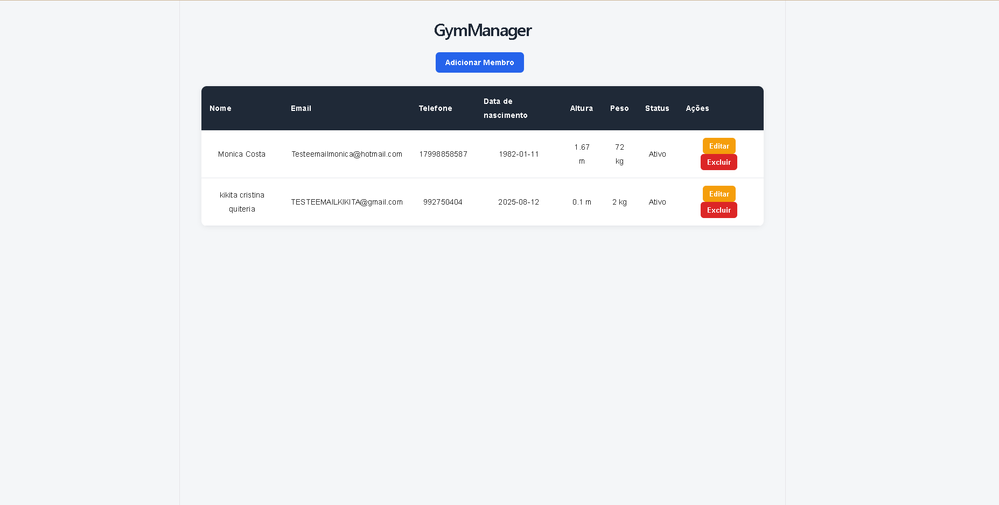
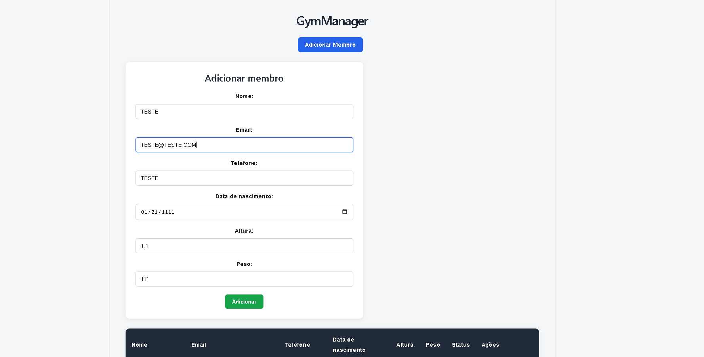
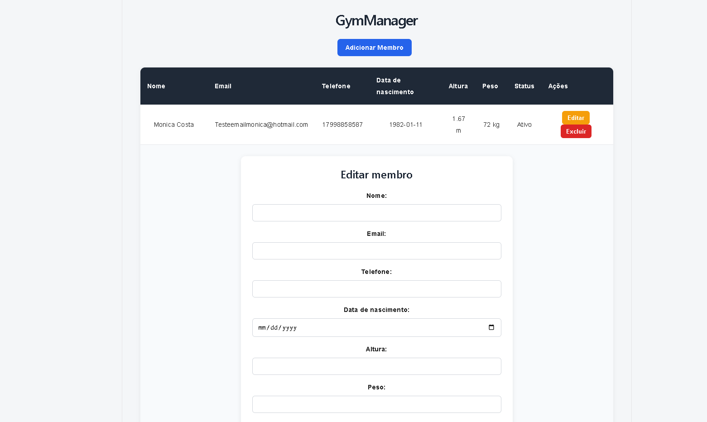
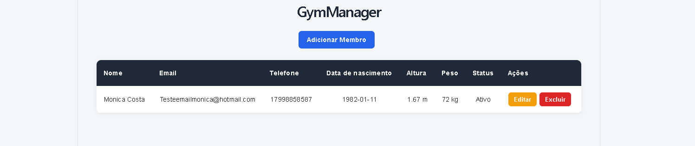

> 🚧 **Projeto em desenvolvimento — estágio inicial do Frontend**
>
> O Gym Manager ainda está em desenvolvimento e estas imagens representam o estado atual da aplicação (16/08/2026), principalmente para acompanhar minha evolução durante os estudos.
>
> Atualmente estou nas primeiras semanas de estudo de **JavaScript, TypeScript e React**, depois de ter construído a base do projeto com **Java e Spring Boot**.
>
> O frontend ainda está bastante simples e algumas partes ainda serão refatoradas, melhoradas e reorganizadas. A ideia é continuar evoluindo a aplicação conforme avanço nos estudos.
> 
> Ainda falta também estruturção de outras etapas do backend!

## Tela principal



Nesta versão já é possível visualizar os membros cadastrados e realizar ações como editar e excluir.

## Cadastro de membro



O formulário permite cadastrar um novo membro e enviar os dados para a API desenvolvida em Spring Boot.

## Edição de membro



A funcionalidade de atualização já está implementada, mas o preenchimento automático dos dados no formulário ainda está sendo melhorado.

## Exclusão de membro



A exclusão é realizada através da API e a tabela é atualizada após a operação.
# Gym Manager

Projeto Full Stack para gerenciamento de academia, desenvolvido com **Java, Spring Boot, PostgreSQL, React e TypeScript**.

Estou desenvolvendo o Gym Manager como projeto de estudo e portfólio, com o objetivo de praticar desenvolvimento Backend Java e, aos poucos, evoluir para uma aplicação Full Stack mais completa.


##  Objetivo

A ideia do Gym Manager é simular um sistema que possa ser utilizado por academias e personal trainers para gerenciamento de alunos, exercícios e treinos.

O projeto começou com o desenvolvimento da API em Java e Spring Boot e posteriormente ganhou um frontend em React e TypeScript.

---

#  Tecnologias

## Backend

- Java 25
- Spring Boot
- Spring Web
- Spring Data JPA
- Hibernate
- PostgreSQL
- Maven
- Lombok
- Spring Security

## Frontend

- React
- TypeScript
- Vite
- HTML
- CSS
- ESLint

## Ferramentas

- Git
- GitHub
- IntelliJ IDEA
- Visual Studio Code

---

#  Arquitetura

O backend utiliza uma arquitetura em camadas:

Controller
→
Service
→
Repository
→
PostgreSQL

A estrutura do backend é separada principalmente entre:

- Controllers
- Services
- Repositories
- Entities
- DTOs
- Requests
- Responses

No frontend, estou utilizando React com componentes funcionais, props, gerenciamento de estado e integração com a API REST.

---

# ✅ Funcionalidades

## 👤 Membros

### Backend

- [x] Cadastro de membros
- [x] Listagem de membros
- [x] Busca de membro por ID
- [x] Atualização de membros
- [x] Exclusão de membros

### Frontend

- [x] Listagem de membros
- [x] Cadastro de membros
- [x] Exclusão de membros
- [x] Atualização de membros
- [ ] Preenchimento automático do formulário ao editar

---

##  Treinos e exercícios

- [ ] Cadastro de exercícios
- [ ] Categorias de exercícios
- [ ] Criação de treinos
- [ ] Associação de exercícios aos treinos
- [ ] Associação de treinos aos membros

---

# 📚 O que estou praticando

## Java e Spring Boot

- Programação Orientada a Objetos
- Arquitetura em camadas
- Controller, Service e Repository
- Injeção de dependências
- DTOs
- Records
- Spring Data JPA
- Hibernate
- Persistência de entidades
- APIs REST
- CRUD
- Requisições GET, POST, PUT e DELETE
- Optional
- orElseThrow()
- Conversão de Entity para DTO
- Relacionamento entre recursos
- PostgreSQL
- Spring Security

## TypeScript

- Tipagem estática
- Interfaces e Types
- Promise
- async/await
- fetch
- JSON
- Manipulação do DOM
- Eventos
- addEventListener
- Template literals
- forEach
- filter
- import e export
- Formulários
- Tipagem de eventos

## React

- Componentes funcionais
- JSX / TSX
- Props
- Callback functions
- useState
- useEffect
- Renderização condicional
- Renderização de listas com map
- Formulários
- Comunicação entre componentes
- Gerenciamento de estado
- Integração com API REST

---

#  Próximos passos

## Backend

- [ ] CRUD de exercícios
- [ ] Categorias de exercícios
- [ ] CRUD de treinos
- [ ] Relacionamento entre exercícios e treinos
- [ ] Relacionamento entre treinos e membros
- [ ] Bean Validation
- [ ] Tratamento global de exceções
- [ ] Enums
- [ ] Melhorias na configuração de segurança
- [ ] Autenticação
- [ ] Autorização
- [ ] Testes unitários
- [ ] Testes de integração
- [ ] Documentação da API

## Frontend

- [ ] Preenchimento automático do formulário de edição
- [ ] CRUD de exercícios
- [ ] CRUD de treinos
- [ ] Dashboard
- [ ] Busca e filtros
- [ ] Tratamento de erros
- [ ] Feedback visual das operações
- [ ] Melhorias de UX/UI
- [ ] Responsividade
- [ ] Autenticação
- [ ] Controle de acesso

## Deploy

- [ ] Deploy do backend
- [ ] Deploy do frontend
- [ ] Banco de dados em produção
- [ ] Configuração das variáveis de ambiente
- [ ] Publicação da aplicação
- [ ] Documentação da aplicação publicada

---

# ▶️ Como executar o projeto

## Pré-requisitos

- Java 25
- Maven
- PostgreSQL
- Node.js
- npm
- Git

---

## 1. Banco de dados

Crie um banco PostgreSQL chamado:

```text
gymmanager
````

O projeto utiliza variáveis de ambiente para as credenciais do banco.

Configure:

```text
DB_USERNAME=seu_usuario
DB_PASSWORD=sua_senha
```

O `application.properties` utiliza essas variáveis:

```properties
spring.datasource.username=${DB_USERNAME}
spring.datasource.password=${DB_PASSWORD}
```

> Não coloque suas credenciais diretamente no repositório.

---

## 2. Executando o Backend

Na raiz do projeto.

### Windows

```bash
mvnw.cmd spring-boot:run
```

### Linux / macOS

```bash
./mvnw spring-boot:run
```

Por padrão, a API ficará disponível em:

```text
http://localhost:8080
```

---

## 3. Executando o Frontend

Entre na pasta do frontend:

```bash
cd frontend
```

Instale as dependências:

```bash
npm install
```

Execute o projeto:

```bash
npm run dev
```

O Vite disponibilizará o frontend em um endereço semelhante a:

```text
http://localhost:5173
```

---

# 🔗 Integração

Atualmente o frontend React se comunica com a API REST desenvolvida em Spring Boot.

React + TypeScript
->
HTTP
->
Spring Boot
->
Spring Data JPA
->
PostgreSQL

---


#  Status

**Em desenvolvimento**

O CRUD de membros já está funcionando no backend e no frontend.

Atualmente o foco está na evolução do frontend, implementação dos módulos de exercícios e treinos e, posteriormente, testes, segurança e publicação da aplicação.

