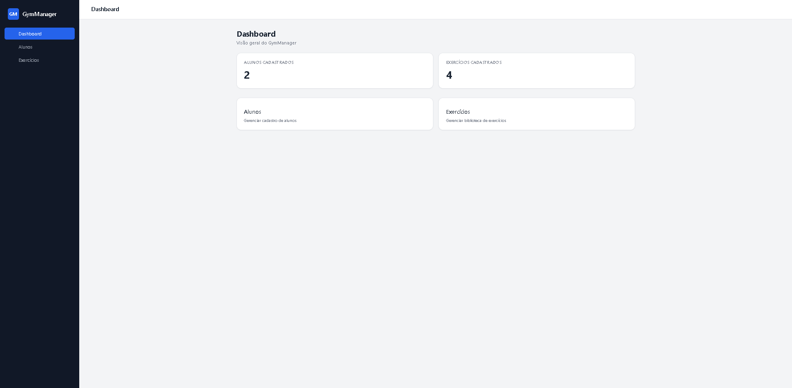
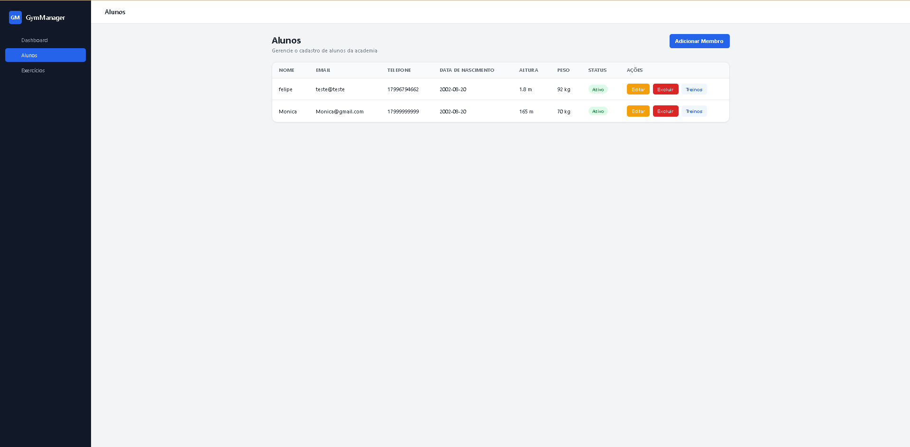
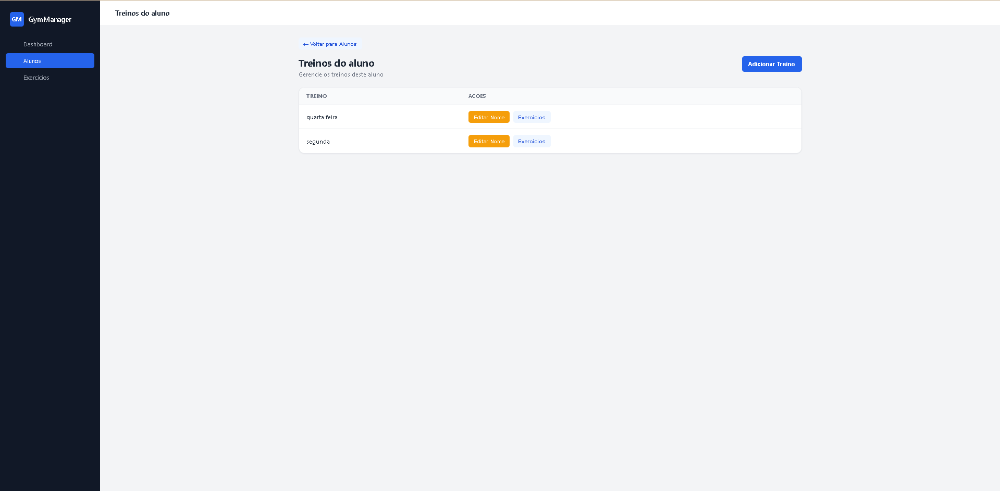
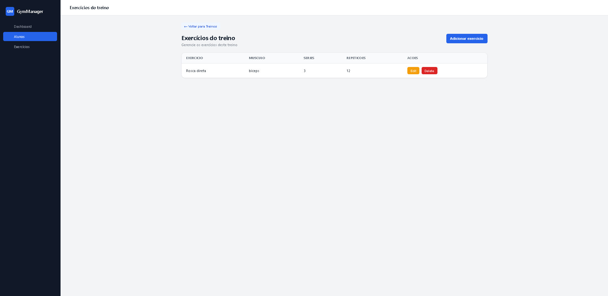
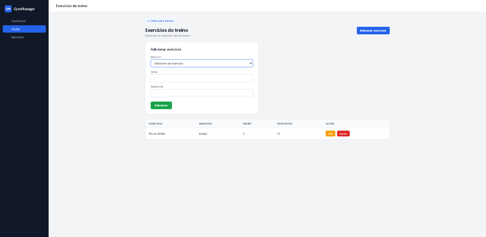

# Gym Manager

Aplicação Full Stack para gerenciamento de academia, desenvolvida como projeto de estudo e portfólio com foco em Backend Java e integração com frontend React/TypeScript.

O projeto simula um sistema para gerenciamento de alunos, exercícios e treinos, permitindo praticar conceitos de desenvolvimento de APIs REST, persistência de dados, relacionamento entre entidades e construção de interfaces web.

>  **Projeto em desenvolvimento**
>
> O Gym Manager continua em evolução conforme novos conhecimentos são incorporados ao projeto. As funcionalidades atuais representam o estágio mais recente da aplicação.

---

## 📸 Screenshots

### Dashboard



### Alunos



### Treinos do aluno



### Exercícios do treino



### Exemplo Form



---

##  Objetivo

O Gym Manager foi desenvolvido para simular um sistema que poderia ser utilizado por academias e personal trainers para gerenciamento de alunos, exercícios e treinos.

O projeto começou com o desenvolvimento da API utilizando Java e Spring Boot e posteriormente ganhou um frontend desenvolvido com React e TypeScript.

O principal objetivo é utilizar o projeto como ambiente de aprendizado e prática, evoluindo gradualmente desde operações básicas de CRUD até recursos mais avançados de segurança, validação, testes e publicação.

---

##  Tecnologias

### Backend

- Java 25
- Spring Boot
- Spring Web
- Spring Data JPA
- Hibernate
- PostgreSQL
- Maven
- Lombok

### Frontend

- React
- TypeScript
- Vite
- HTML
- CSS
- ESLint
- React Router

### Ferramentas

- Git
- GitHub
- IntelliJ IDEA
- Visual Studio Code

---

##  Arquitetura

### Backend

O backend utiliza uma arquitetura em camadas:

```text
Controller
    ↓
Service
    ↓
Repository
    ↓
PostgreSQL

A aplicação está organizada principalmente em:

Controllers
Services
Repositories
Entities
DTOs
Requests
Responses
Frontend

O frontend utiliza React com componentes funcionais, gerenciamento de estado, props, hooks e React Router para navegação entre as páginas.

A comunicação entre frontend e backend é realizada através de uma API REST.

React + TypeScript
        ↓
      HTTP
        ↓
  Spring Boot
        ↓
 Spring Data JPA
        ↓
   PostgreSQL
   ```

### ✅ Funcionalidades
### 👤 Membros
- Cadastro de membros
- Listagem de membros
- Busca de membro por ID
- Atualização de membros
- Exclusão de membros
- Indicação visual de status do membro
### 🏋️ Exercícios
- Cadastro de exercícios
- Listagem de exercícios
- Atualização de exercícios
- Exclusão de exercícios
- Identificação do grupo muscular
### 📋 Treinos
- Cadastro de treinos
- Listagem de treinos
- Atualização de treinos
- Exclusão de treinos
- Associação de treino a um membro
### 🔗 Exercícios nos treinos
- Associação de exercícios a treinos
- Definição de séries
- Definição de repetições
- Listagem dos exercícios de um treino
- Atualização das informações
- Exclusão de exercícios do treino
### 🖥️ Interface
- Dashboard
- Navegação entre páginas
- Sidebar
- Header
- Componentes reutilizáveis
- Melhorias de UI/UX
- Layout responsivo
### 📚 Conhecimentos praticados
- Java e Spring Boot
- Programação Orientada a Objetos
- Arquitetura em camadas
- Controller, Service e Repository
- Injeção de dependências
- DTOs
- Records
- Spring Data JPA
- Hibernate
- Persistência de entidades
- APIs REST
- CRUD
- Requisições GET, POST, PUT e DELETE
- Optional
- orElseThrow()
- Conversão de Entity para DTO
- Relacionamentos entre entidades
- PostgreSQL
- TypeScript
- Tipagem estática
- Interfaces e Types
- Promise
- async/await
- fetch
- JSON
- Eventos
- Template literals
- map
- find
- filter
- import e export
- Formulários
- Tipagem de eventos
- React
- Componentes funcionais
- JSX / TSX
- Props
- children
- Callback functions
- useState
- useEffect
- Renderização condicional
- Renderização de listas com map
- Formulários
- Comunicação entre componentes
- Gerenciamento de estado
- Integração com API REST
- React Router
- useNavigate
- useParams
▶️ Como executar o projeto
Pré-requisitos
Java 25
Maven
PostgreSQL
Node.js
npm
Git
### 1. Banco de dados

Crie um banco PostgreSQL chamado:

gymmanager

O projeto utiliza variáveis de ambiente para as credenciais do banco.

Configure:

DB_USERNAME=seu_usuario
DB_PASSWORD=sua_senha

O application.properties utiliza essas variáveis:

spring.datasource.username=${DB_USERNAME}
spring.datasource.password=${DB_PASSWORD}

Importante: não coloque suas credenciais diretamente no repositório.

### 2. Executando o Backend

Na raiz do projeto.

Windows
mvnw.cmd spring-boot:run
Linux / macOS
./mvnw spring-boot:run

A API estará disponível em:

http://localhost:8080
### 3. Executando o Frontend

Entre na pasta:

cd frontend

Instale as dependências:

npm install

Execute:

npm run dev

O frontend estará disponível em:

http://localhost:5173
### 🚀 Próximos passos
### Backend
- Bean Validation
- Tratamento global de exceções
- Enums
- Melhorias na configuração de segurança
- Autenticação
- Autorização
- Testes unitários
- Testes de integração
- Documentação da API
### Frontend
- Tratamento de erros
- Feedback visual das operações
- Busca e filtros
- Melhorias de UX/UI
- Autenticação
- Controle de acesso
### Deploy
- Deploy do backend
- Deploy do frontend
- Banco de dados em produção
- Configuração das variáveis de ambiente
- Publicação da aplicação
- Documentação da aplicação publicada
📌 Status do projeto

### Em desenvolvimento

O Gym Manager já possui uma base funcional de backend e frontend, incluindo gerenciamento de membros, exercícios, treinos e associação de exercícios aos treinos.

O próximo foco do projeto é consolidar a camada de qualidade e segurança, com tratamento de exceções, validações, testes e autenticação, além da preparação para publicação da aplicação.

### 👨‍💻 Sobre o projeto

O Gym Manager faz parte da minha jornada de estudos em desenvolvimento de software, com foco inicial em Backend Java e evolução gradual para desenvolvimento Full Stack.

O projeto está sendo construído de forma incremental, utilizando novas funcionalidades como oportunidade para aplicar na prática os conceitos estudados.